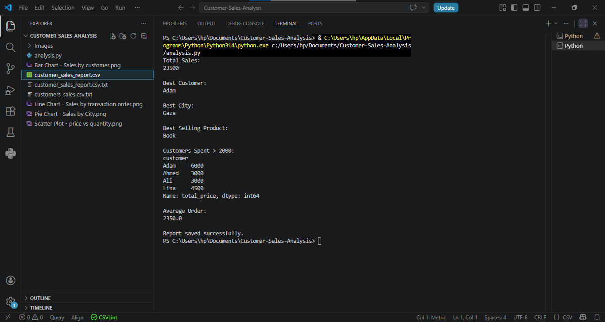
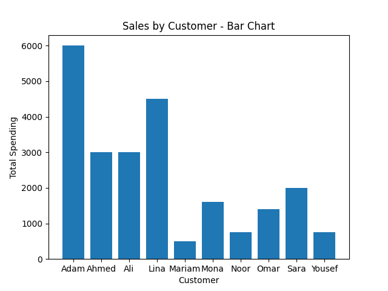
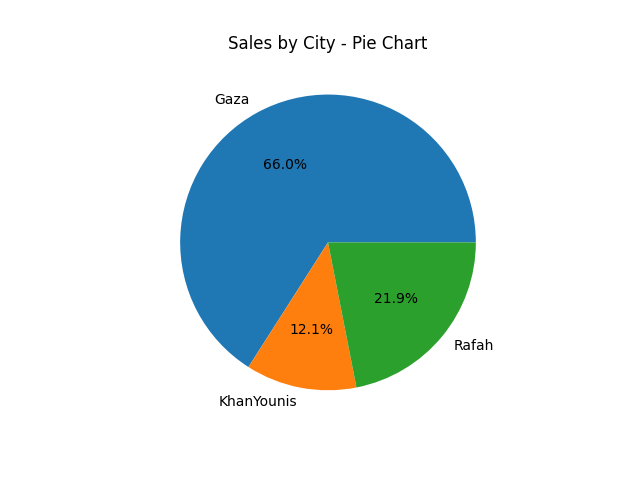
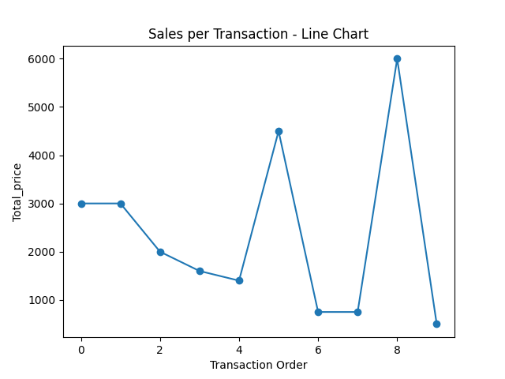
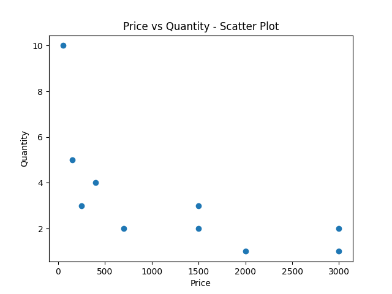

# 📊 Customer Sales Analysis

A comprehensive data analysis project using Python (Pandas & Matplotlib) to extract actionable business insights from customer sales data.

## 📌 Analysis Objectives

- Calculate *Total Sales* revenue.
- Identify the *Best Customer* (highest spender).
- Determine the *Best City* (highest sales volume).
- Find the *Best Selling Product* (by quantity).
- Filter *Customers who spent more than 2000*.
- Calculate the *Average Order Value*.
- Visualize data using *4 different charts*:
  - *Bar Chart*: Sales distribution per customer.
  - *Pie Chart*: Sales percentage per city.
  - *Line Chart*: Sales trend per transaction order.
  - *Scatter Plot*: Relationship between product price and quantity.

## 🛠️ Technologies Used

- *Python 3.x*
- *Pandas* – Data manipulation and analysis.
- *Matplotlib* – Data visualization.

## 📸 Screenshots

### Terminal Output

The terminal shows key results after running the script.

---

### Visualizations

*Bar Chart - Sales by Customer*

*Pie Chart - Sales by City*

*Line Chart - Sales per Transaction Order*

*Scatter Plot - Price vs Quantity*

---

### Exported Reports

*CSV Report Exported to Excel*

## 🚀 How to Run

1.  *Clone the repository* or download the files.
2.  *Install dependencies*:
    
    pip install -r requirements.txt
    
3.  *Important Note about the data file*:
    - The script reads a file named customers_sales.csv.txt. 
    - Please ensure your data file is named exactly customers_sales.csv.txt and placed in the same directory as analysis.py.
    - *(Tip: If you prefer using .csv, simply rename the file and change the filename in the script).*
4.  *Run the script*:
    
    python analysis.py
    
5.  The results will be printed in the terminal, followed by the charts (Bar, Pie, Line, Scatter).

## 📁 Project Structure

Customer-Sales-Analysis/
├── analysis.py                        # Main Python script
├── customers_sales.csv.txt            # Input data file
├── customer_sales_report.csv          # Generated output report
├── requirements.txt                   # Dependencies
├── README.md                          # Project documentation
└── images/                            # Screenshots folder
